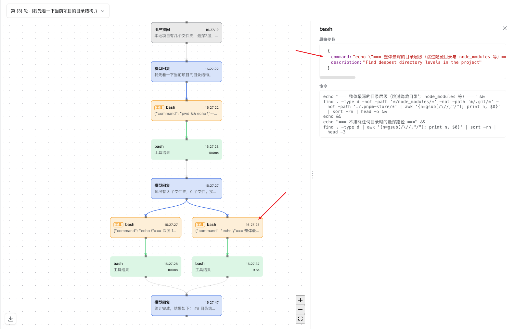
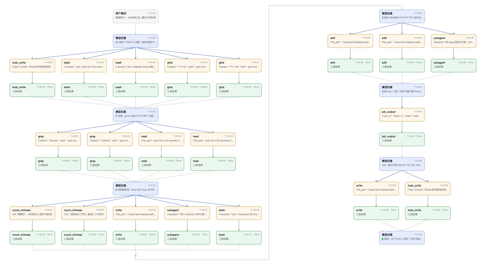
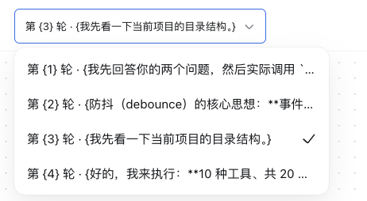

# dsh-plugin-execution-graph

English | [中文](README.zh.md)

A DeepSeek Harness (DSH) client plugin that adds an **"Execution graph"** tab to the conversation view. It reconstructs one session turn's activity as a vertical timeline on a [React Flow](https://reactflow.dev) canvas: the turn's `request-header`, `assistant-message`, `tool-call`, and `tool-result` nodes are ranked into timeline steps stacked top-to-bottom and connected by arrowed edges from each step to the next. `turn-group` container nodes are not drawn — one turn is shown at a time (defaulting to the session's last), so a container box would be redundant. Tool calls are never merged by name — each call and its result are independent nodes tied by a `resolves` edge, an assistant message's tool-call blocks connect to their `tool-call` nodes by a `triggers` edge, and same-group nodes chain by a `sequence` edge in event order. Parallel tool calls triggered by one assistant message share a timeline step and spread horizontally; a column is capped at ten steps and then wraps into the next column block to the right, and when a column's last row holds several parallel nodes feeding the next column, their connectors converge through a merge junction before bending into the next column. A running tool call (present in the shared Session window's running-call-id set, with no settled result yet) renders with a distinct dashed, pulsing border instead of a fabricated result. A `tool-call` card puts its `Tool` kind label and tool name on one row and a truncated argument preview on the next. Selecting a node fills a persistent detail sidebar to the right — resizable (320–600px, collapsible) — that shows a `Payload` JSON tree for tool calls and a line-broken command block for shell commands. A turn selector above the canvas lists every turn and defaults to the last; switching turns re-centers the canvas at scale 1. A download button in the canvas's lower-left corner exports the whole graph as a PNG. Each `assistant-message` card carries a fold toggle on its right edge: collapsing hides the tool calls/results that follow it up to the next assistant message (an in-place view transform — columns and coordinates stay fixed), leaving a fold capsule that bridges the collapsed reply to the next one and can be clicked to expand. The package provides no service and declares no Context merge; it registers target-specific Conversation Event Definitions, a Graph view snapshot builder, and one tab in the conversation's `'conversation.view'` slot ring.

## Plugin results





## Plugin declaration and lifecycle

This is a pure-consumer Cordis plugin with two entry faces:

- **Node half** (`src/index.ts`) — a no-op `apply()`; the plugin has no host-side behavior.
- **Client half** (`src/client/index.ts`) — the real plugin. It exports `inject` and `apply(ctx)`, following the DSH function-plugin contract (no default export).

`apply(ctx)` performs exactly these side effects, each registered reversibly through the Cordis effect system so that unloading the plugin reverts them in full:

1. **Locale dictionary** — `ctx.effect(() => ctx.locale.register('graph', { zh, en }))`; unload de-registers the `graph` namespace.
2. **React Flow stylesheet** — `installGraphStyles(ctx)` injects a plugin-tagged `<style>` element for the vendored React Flow base stylesheet; the effect's disposer removes the tag on unload.
3. **Conversation Event Definitions** — `registerGraphNodeDefinitions(ctx)` folds `request/header`, `assistant/message`, `user/message`, and `tool/call`→`tool/result` events into graph contributions.
4. **Conversation View Definition** — `registerGraphConversationView(ctx)` registers the `graph` target's snapshot builder.
5. **UI slot** — `ctx.slots.inject('conversation.view', () => ctx.slots.register({ id: 'graph', … }, GraphView))`; `slots.register` returns a disposer and rides the slot service's effect wrapper, so unload removes the tab.

Because every contribution goes through `ctx.effect` / `ctx.on` and `slots.register`'s returned disposer, unloading the plugin (or disposing its fiber) removes the tab, the locale dictionary, and the stylesheet, restoring the system to its pre-load state. No config rows are written, so there is nothing to clean up on disk. HMR is supported by the framework: a config change that disables the plugin unloads these effects; no manual restart is required beyond the framework's own reload.

## Service dependencies and injection

`inject = ['slots', 'conversationEvents', 'conversationViews', 'locale']`.

These are the services the plugin requires at load time; each is provided by the base DSH client stack (`@deepseek-ai/dsh-base` and the web surface) and declared via the package's `dsh.client.inject` manifest. The plugin declares no optional dependencies and performs no `ctx.get()` of optional services. Because it declares its injections, Cordis disposes the plugin automatically if one of these services is unloaded and re-mounts it when the service returns — the plugin does not need to observe dependency loss itself.

## Configuration and scope

The plugin has **no user-configurable options** and takes no `config:` block; it is enabled or disabled purely by its presence in the boot roster. It runs in the global client scope — it contributes one conversation-view tab available to every session — and holds no per-session or per-user state; all rendering state is derived from the session's own view snapshot.

## Installation

Install into a profile with `dsh plugin`, which reads the package's `dsh.bundle` manifest:

```sh
dsh plugin --profile <name> add dsh-plugin-execution-graph
```

The bundle's `cordis.patch.yml` appends one row to the client roster:

```yaml
- insert:
    - id: execution-graph
      name: dsh-plugin-execution-graph
```

Because the plugin has no config options, users do not edit `cordis.patch.yml` themselves; disabling it is `dsh plugin --profile <name> remove dsh-plugin-execution-graph`.

### Requirements

- A DSH runtime hosting the client web surface (the `dsh` CLI with a web-enabled profile) on the **`@next` line** — i.e. the DSH core packages (`@deepseek-ai/dsh-client-*`, `@deepseek-ai/dsh-*`) at `^0.1.1-rc.2` with `@deepseek-ai/cordis` at `^4.0.1`, exactly as declared in this package's `peerDependencies`. DSH publishes this line under the npm `next` dist-tag (`latest` still points to the older `0.0.1-rc.1`), so a consumer profile must install DSH core from `@next`.
- `@deepseek-ai/dsh-client-ui-primitives` and `@deepseek-ai/dsh-client-ui-slots` are **not** peer dependencies: they are platform modules the DSH host shares into its frozen module table, so the plugin's client bundle imports them as externals resolved by the host.
- Node.js ≥ 22 and pnpm for a from-source checkout.

## Extension points and compatibility

The plugin uses only official DSH extension points and never forks or patches core code:

- **Conversation Event Definitions** (`conversationEvents`) and **Conversation View Definition** (`conversationViews`) — the same two-tier fold/build pipeline Trajectory uses, to project session events into a `GraphSnapshot`.
- **UI slot** — injects into the `'conversation.view'` slot ring (id `graph`, order 20), alongside Chat and Trajectory.
- **Locale** — registers the `graph` dictionary namespace.

**Contract tests.** The package carries a client-bundle test that loads the built `lib/client.js` through `window.__ModuleLoader__.load` and asserts the handoff id and the `apply`/`inject` exports, and a views test that mounts the plugin on a real `SlotRegistry` ring and asserts the tab appears. An **unload test** disposes the fiber and asserts the view tab, the conversation-event registrations, and the view-builder registrations are all removed.

## Folding tool segments

A long agent turn interleaves assistant replies with many tool calls/results. Each `assistant-message` card carries a fold toggle on its right edge; clicking it hides everything between that reply and the next assistant message, so the timeline reads as the conversation's reply spine with the tool busywork tucked away.

Folding is an **in-place view transform**, not a re-layout:

- The timeline is always laid out from the full, unfolded snapshot, so column assignment, node coordinates, and the current pan/zoom all stay fixed across fold/expand.
- The hidden tool calls/results leave the canvas; a **fold capsule** appears directly under the collapsed reply, labelled with the number of hidden nodes, and bridges the reply to the next assistant message with a dashed arrow.
- Clicking the capsule (or the reply card's toggle, now pointing to expand) restores the segment.

Only an assistant message that actually has following tool nodes is foldable — a reply with no tool segment shows no toggle. Folding is per-assistant and independent: collapsing one reply never hides another's segment. Segment ownership is derived from timeline order (`assistantFoldMembers`), and the hidden set plus capsules are computed purely by `foldCapsuleView`.

## Model Experience

None, as the graph view renders session data in the browser; nothing here reaches a model request.

#### KV Cache effect

None; this package neither assembles nor sends a provider request.

## Known Limitations and Deferred Work

- **Layout recomputes on every snapshot change** — the timeline is laid out from scratch on each render rather than incrementally repositioning only new nodes, so very long sessions pay a growing layout cost per update. No pagination or windowing exists yet; the view always renders the whole selected turn.
- **Vendored React Flow base stylesheet** — the functional layout styles are copied to `src/client/styles/reactflow-base.css` and injected as a plugin-owned `<style>` tag, because the client bundler resolves `.css` imports relative to the importer and cannot take a bare `@xyflow/react/dist/base.css` import. Bump the copy alongside the `@xyflow/react` dependency.
